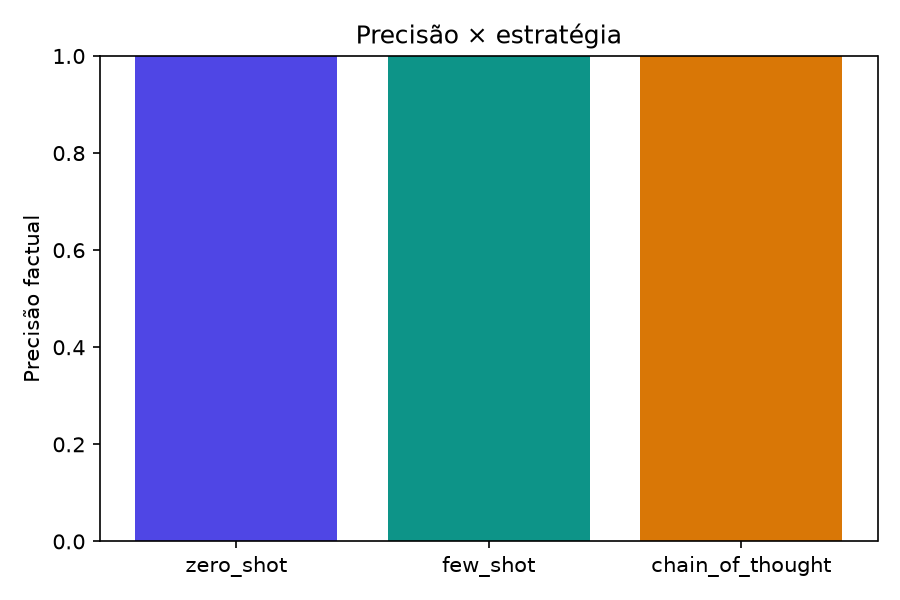
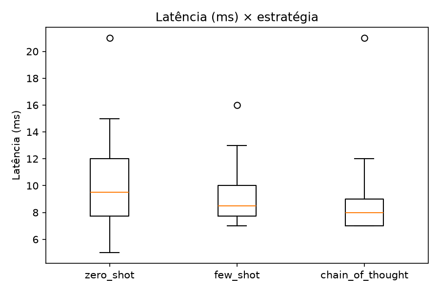
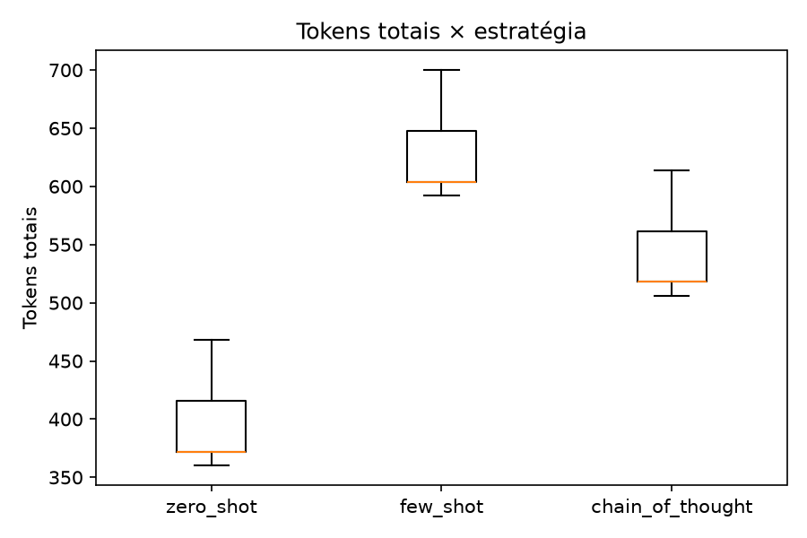

# Análise dos resultados

**Origem dos dados:** VALIDACAO DE PIPELINE (oracle-fake) — NAO representa desempenho de LLM real
**Execuções:** 60 · **modelos:** 1 · **técnicas:** 3 · **questões:** 20

## Estatística descritiva por técnica

### Precisão factual

| Técnica | n | média | mediana | dp | mín | máx | IC95% |
|---|---|---|---|---|---|---|---|
| chain_of_thought | 18 | 1.0000 | 1.0000 | 0.0000 | 1.0000 | 1.0000 | [1.0000, 1.0000] |
| few_shot | 18 | 1.0000 | 1.0000 | 0.0000 | 1.0000 | 1.0000 | [1.0000, 1.0000] |
| zero_shot | 18 | 1.0000 | 1.0000 | 0.0000 | 1.0000 | 1.0000 | [1.0000, 1.0000] |

### Latência (ms)

| Técnica | n | média | mediana | dp | mín | máx | IC95% |
|---|---|---|---|---|---|---|---|
| chain_of_thought | 20 | 8.7500 | 8.0000 | 3.1098 | 7.0000 | 21.0000 | [7.2946, 10.2054] |
| few_shot | 20 | 9.2000 | 8.5000 | 2.3530 | 7.0000 | 16.0000 | [8.0987, 10.3013] |
| zero_shot | 20 | 10.1500 | 9.5000 | 3.7173 | 5.0000 | 21.0000 | [8.4102, 11.8898] |

### Tokens totais

| Técnica | n | média | mediana | dp | mín | máx | IC95% |
|---|---|---|---|---|---|---|---|
| chain_of_thought | 20 | 539.3000 | 518.0000 | 37.2998 | 506.0000 | 614.0000 | [521.8432, 556.7568] |
| few_shot | 20 | 625.3000 | 604.0000 | 37.2998 | 592.0000 | 700.0000 | [607.8432, 642.7568] |
| zero_shot | 20 | 393.3000 | 372.0000 | 37.2998 | 360.0000 | 468.0000 | [375.8432, 410.7568] |

## Testes de significância

**Teste (Friedman) — Precisão factual:** não aplicável (sem variabilidade).

**Teste (Friedman) — Latência:** χ²=2.5714, p=0.2765, W de Kendall=0.0643, blocos=20.
- chain_of_thought vs few_shot: p=0.298 (Holm=0.4649), rank-biserial=0.3143.
- chain_of_thought vs zero_shot: p=0.155 (Holm=0.4649), rank-biserial=0.4167.
- few_shot vs zero_shot: p=0.1855 (Holm=0.4649), rank-biserial=0.3750.

**Teste (Friedman) — Tokens:** χ²=40.0000, p=2.061e-09, W de Kendall=1.0000, blocos=20.
- chain_of_thought vs few_shot: p=7.744e-06 (Holm=0.0000), rank-biserial=1.0000.
- chain_of_thought vs zero_shot: p=7.744e-06 (Holm=0.0000), rank-biserial=1.0000.
- few_shot vs zero_shot: p=7.744e-06 (Holm=0.0000), rank-biserial=1.0000.

## Figuras

